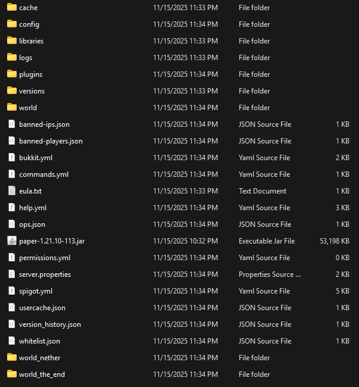
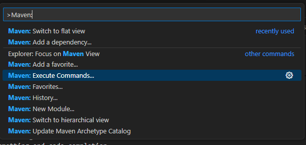
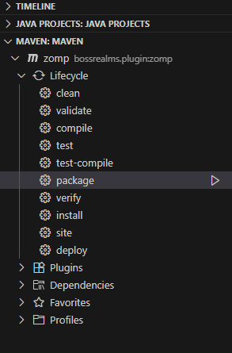

# Boss Realms

## Table of Contents

1. [Prerequisites](#prerequisites)
   - [Downloads](#downloads)
   - [VS Code Extensions](#vs-code-extensions)
   - [Maven Setup](#maven-setup)
   - [Release Notes Setup](#release-notes-setup)
   - [Server Properties](#server-properties)
2. [Development](#development)
   - [Compiling the Plugin](#compiling-the-plugin)
   - [Running the Server](#running-the-server)
   - [Contribution Workflow](#contribution-workflow)
3. [Creating Release Notes](#creating-release-notes)

## Prerequisites

### Downloads

There are a couple of prerequisite downloads. Do NOT assume you have the right versions without doing a quick check.

1. Install the [Java Development Kit](https://www.oracle.com/java/technologies/downloads/).
   Make sure you have version 17 or higher, which is used by newer versions of Minecraft.

```
> javac --version
javac 21.0.9
```

2. Install [Git](https://git-scm.com/downloads), which we use for version control.
   Make sure to add this to your `Path` if the installer does not do it for you.

```
> git -v
git version 2.43.0.windows.1
```

3. Install [Python](https://www.python.org/downloads/), which we use for creating release notes.
   Install the following libraries.

```
> python --version
Python 3.11.3

> pip install requests
...
> pip install PyGithub
...
```

4. Download [Apache Maven](https://maven.apache.org/download.cgi), the project manager we use to automate the build process.

```
> cd /path-to-maven-download/bin
> ./mvn --version
Apache Maven 3.9.11 (3e54c93a704957b63ee3494413a2b544fd3d825b)
...
```

5. Download the [Paper Jar](https://papermc.io/downloads/paper)).

   - Create a folder `/paper` inside the project and move the file here.
     - On VSCode, you can create a `.vscode/tasks.json` to create a task to run the server
       #### .vscode/tasks.json
       ```json
       {
         "version": "1.0.0",
         "tasks": [
           {
             "label": "Run Paper Server",
             "type": "shell",
             "command": "cd '__absolute\\path\\to\\paper'; java -jar .\\paper-1.21.10-113.jar --nogui",
             "windows": {
               "command": "cd '__absolute\\path\\to\\paper'; java -jar .\\paper-1.21.10-113.jar --nogui"
             },
             "group": "test",
             "presentation": {
               "reveal": "always",
               "panel": "new"
             }
           }
         ]
       }
       ```
   - Run the jar twice. The first run will generate several folders such as cache, libraries, and versions. The second time you run the jar, it will generate a `eula.txt`. Open this file and set `eula=TRUE`.
   - Run the jar a third time to generate the remainder of the server files. It should look similar to this:

     

### VS Code Extensions

VS Code is the recommended development environment for this project.
For ease of development, install the following extensions:

- _Language Support for Java_ for formatting and code-completion
- _Maven for Java_ unless you like manually typing `mvn` commands every time
  - You may have to run this command from the _Command Palette_  
    
  - Command Palette Hotkey:
    - Windows: `Ctrl+Shift+P`
    - Mac: `Shift+Command+P`
- (optional) Instead, you can add the _Extension Pack for Java_ which will install the first two extensions +
  other useful extensions (test runners, debugging, etc.)
- (optional) You can install the _mvn-package-auto_ extension to automatically package your code after saving.
  - If you install this extension, go into the extension settings to set `Maven Package Auto › Maven › Executable: Options` as `package`.
  - Additionally, you will need to add the Maven bin directory to the system `Path` variable.

### Maven Setup

Set the Maven extension setting **Executable: Path** to `_absolute_path_to_maven_folder\bin\mvn_`.

Alternatively, you can add the Maven bin directory to the system `Path` variable. This step is mandatory if you are using _mvn-package-auto_.

- To verify this, open a new terminal and try `mvn --version`.

### Release Notes Setup

We want to create a [GitHub Personal Access Token](https://docs.github.com/en/authentication/keeping-your-account-and-data-secure/managing-your-personal-access-tokens#creating-a-personal-access-token-classic) to allow the creation of release notes. Store the token in a token.txt file and ensure that it will NOT be pushed to your branch before committing.

You can update `.vscode/tasks.json` to create a task to create the release notes

#### .vscode/tasks.json

```json
{
...
  "tasks": [
  ...
    {
      "label": "Create Release Notes",
      "type": "shell",
      "command": "py create_release_notes.py",
      "windows": {
        "command": "py create_release_notes.py"
      },
      "group": "test",
      "presentation": {
        "reveal": "always",
        "panel": "new"
      }
    }
  ]
  ...
}
```

### Server Properties

There are some server properties you will want to set to enable smoother gameplay. These files can be found in the paper folder.

#### server.properties

`allow-flight=true` => Some kits will stun you, and lead to a pseudo-flying state, which the server will kick you out from.  
`require-resource-pack=true` => Force players to use the server resource pack in the future
`resource-pack-prompt="We may require a texture pack for optimal gameplay."` => Show prompt for enabling resource pack  
`resource-pack="link-to-direct-download-resource-pack.com"` => Resource pack direct download, usually a dropbox link

## Development

### Compiling the plugin

The extension should now automatically detect the project and display an entry in the Maven panel (bottom left).  
  
Click `package` to generate the target folder with the .jar file.

- You may skip this step if you have _mvn-package-auto_ installed.

### Running the server

From the `/paper` folder, run the command `java -jar .\paper-1.21.10-113.jar -nogui`.

- Alternatively, on VSCode, you can run task `Run Paper Server` to start the server instead. You can use the Command Palette to open `Tasks: Run Task`
  - Command Palette Hotkey:
    - Windows: `Ctrl+Shift+P`
    - Mac: `Shift+Command+P`

Once you compile the plugin, the changes will be added to the server automatically. If not, you can simply type `reload` in the terminal.

- If you have _mvn-package-auto_ installed, make sure to wait for the server to be fully online before compiling the plugin to reload. Otherwise, you will have to reload manually on server start.

### Contribution workflow

Pull the latest changes from `main`:

```
git pull origin main
```

Make a feature branch.
Feature branches should be prefixed with a category (e.g. `feature/`, `bugfix/`, `docs/`) and followed by a short description of the changes added.

```
git switch -c feature/add-a-cool-button
```

Make and commit all the changes needed for the new feature.

```
git commit <...>
```

Push changes up to the remote.
If new changes have been added to `main` since you started your feature branch,
you will first need to _rebase_ your changes on top of `main` befor making a pull request
(this may require resolving merge conflicts locally).

```
git pull --rebase origin main
git push origin feature/add-a-cool-button
```

Make a pull request on Github.
Merge the branch as a merge commit and delete the old branch.

## Creating Release Notes

In order to make release notes, run the script with `py create_release_notes.py`

- Alternatively, on VSCode, you can run task `Create Release Notes` to create the notes instead. You can use the Command Palette to open `Tasks: Run Task`
  - Command Palette Hotkey:
    - Windows: `Ctrl+Shift+P`
    - Mac: `Shift+Command+P`

If you get any errors, please do not contact [@matthew-ho-1](https://github.com/matthew-ho-1)

[💩💩💩](https://github.com/keithohno)
